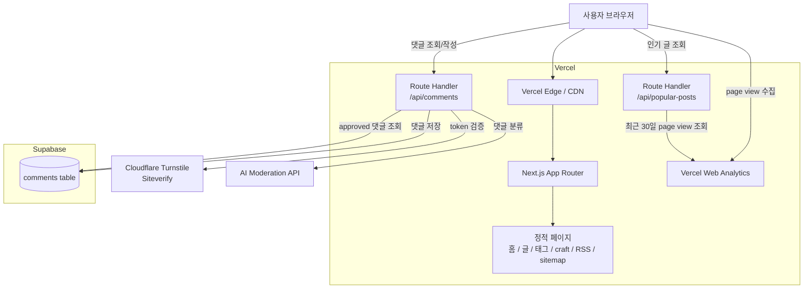
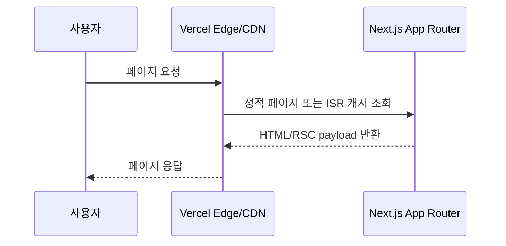
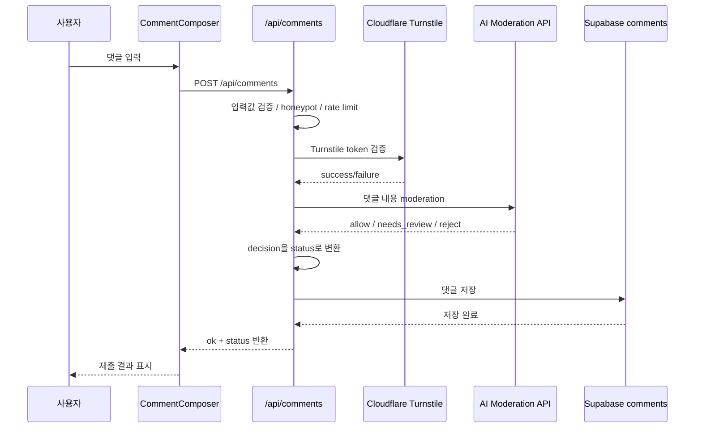
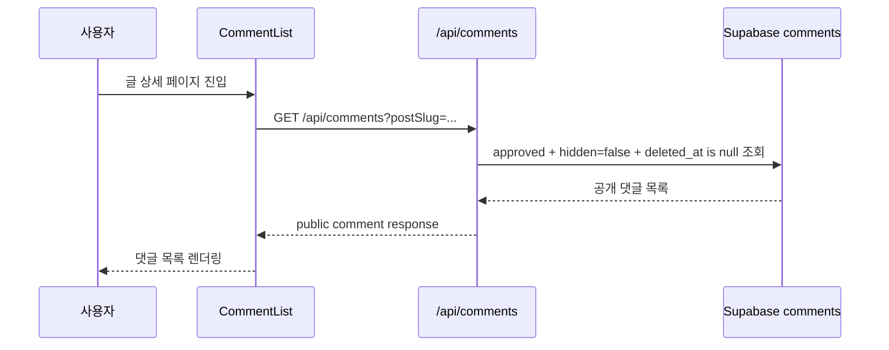
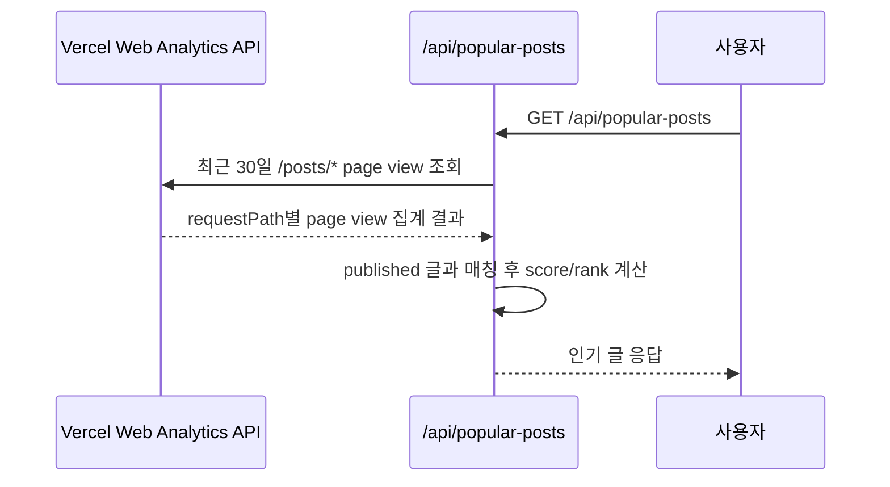
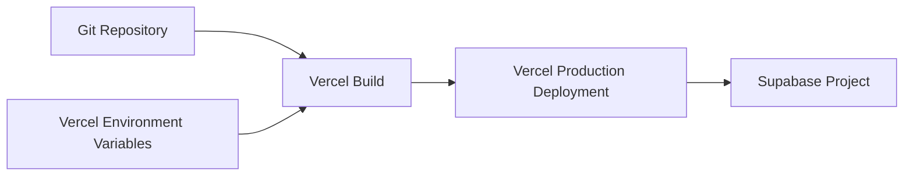

# 인프라 아키텍처

## 목표

정적 중심 Next.js 블로그를 Vercel에 배포하고, 동적 기능은 최소한의 serverless/API 조합으로 처리한다.

핵심 원칙:

- 블로그 본문과 태그 페이지는 가능한 정적으로 제공한다.
- 댓글, moderation, 인기 글 집계는 serverless route에서 처리한다.
- 별도 VPS나 항상 켜져 있는 백엔드 서버는 운영하지 않는다.
- 민감한 API key는 클라이언트에 노출하지 않는다.

## 전체 인프라 구성



## 정적 페이지 제공 흐름



정적으로 제공하는 대상:

```txt
/
/posts
/posts/[slug]
/craft
/tags/[tag]
/rss.xml
/sitemap.xml
```

`/tags/[tag]`는 API 없이 MDX frontmatter의 `tags`를 빌드 시점에 수집해 생성한다.

## 댓글 작성 흐름



댓글 상태 매핑:

```txt
allow        → approved
needs_review → pending
reject       → spam 또는 rejected
```

공개 화면에는 `approved` 댓글만 노출한다.

## 댓글 조회 흐름



public response에는 내부 필드를 포함하지 않는다.

제외 필드:

```txt
moderation_result
ip_hash
user_agent_hash
hidden
deleted_at
```

## 인기 글 집계 흐름



초기 기준:

```txt
popularScore = recentPageViews
```

추후 확장:

```txt
popularScore = recentPageViews + approvedCommentCount * 5
```

추후 캐싱 전략:

```txt
트래픽 증가 또는 API 한도 문제가 생기면 Vercel Cron 하루 1회 집계
필요 시 GitHub Actions scheduled workflow로 batch job 이동
```

현재 구현은 Supabase 캐시 테이블 없이 Route Handler에서 직접 조회한다. 환경 변수가 없거나 Analytics API 조회가 실패하면 published 글 목록 기반 fallback을 반환한다.

## 데이터 저장소

### Supabase `comments`

역할:

- 댓글 저장
- moderation 상태 관리
- 숨김/삭제 상태 관리

주요 상태:

```txt
pending
approved
spam
rejected
```

## 환경 변수

서버 전용:

```txt
TURNSTILE_SECRET_KEY
SUPABASE_SECRET_KEY
AI_API_KEY
VERCEL_ACCESS_TOKEN
VERCEL_PROJECT_ID
VERCEL_TEAM_ID
```

GitHub Actions를 스케줄러로 추가할 경우, 다음 값은 GitHub Repository Secrets에도 등록한다.

```txt
SUPABASE_SECRET_KEY
NEXT_PUBLIC_SUPABASE_URL
VERCEL_ACCESS_TOKEN
VERCEL_PROJECT_ID
VERCEL_TEAM_ID
```

클라이언트 노출 가능:

```txt
NEXT_PUBLIC_SITE_URL
NEXT_PUBLIC_TURNSTILE_SITE_KEY
NEXT_PUBLIC_SUPABASE_URL
NEXT_PUBLIC_SUPABASE_ANON_KEY
```

주의:

- `SUPABASE_SECRET_KEY`는 클라이언트에 노출하지 않는다.
- `TURNSTILE_SECRET_KEY`는 클라이언트에 노출하지 않는다.
- `AI_API_KEY`는 클라이언트에 노출하지 않는다.
- `VERCEL_ACCESS_TOKEN`은 Route Handler, cron, build, GitHub Actions 같은 서버 쪽 작업에서만 사용한다.
- `VERCEL_TEAM_ID`는 팀 프로젝트에서 Vercel Web Analytics API를 조회할 때 사용하며, 개인 프로젝트에서는 생략할 수 있다.

## 배포 구성



배포 전 확인:

- Vercel 프로젝트 생성
- Supabase 프로젝트 생성
- Vercel Web Analytics 활성화
- Turnstile site/secret key 발급
- AI moderation API key 설정
- 환경 변수 등록

## 운영 메모

- 댓글 관리는 초기에는 Supabase table/editor에서 처리한다.
- 별도 admin UI는 댓글이 많아진 뒤 만든다.
- 인기 글은 초기에는 `/api/popular-posts`에서 Vercel Web Analytics API를 직접 조회한다.
- 트래픽 증가 또는 API 한도 문제가 생기면 scheduler와 캐시 저장소를 추가한다.
- 댓글 또는 인기 글 API가 실패해도 전체 페이지 렌더링은 깨지지 않아야 한다.
