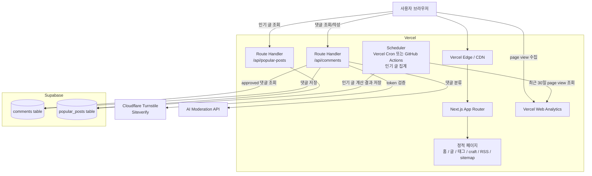
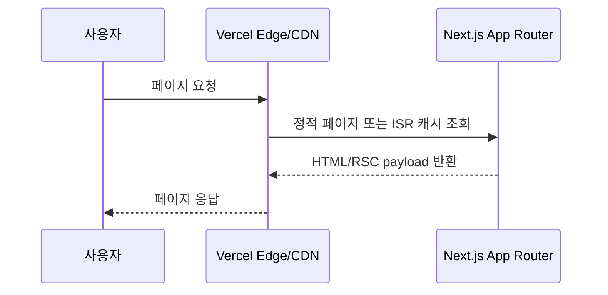
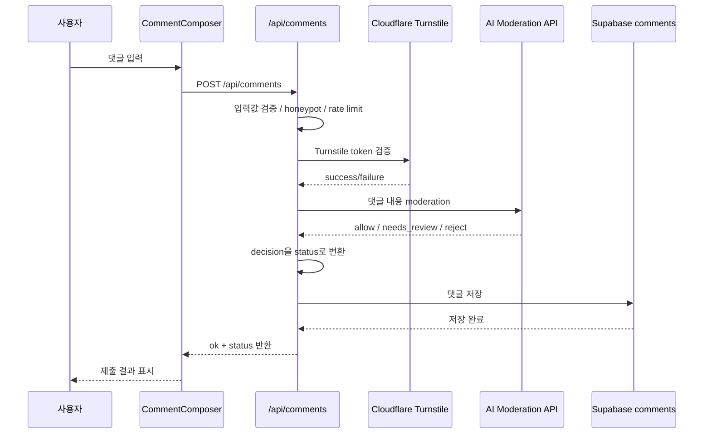
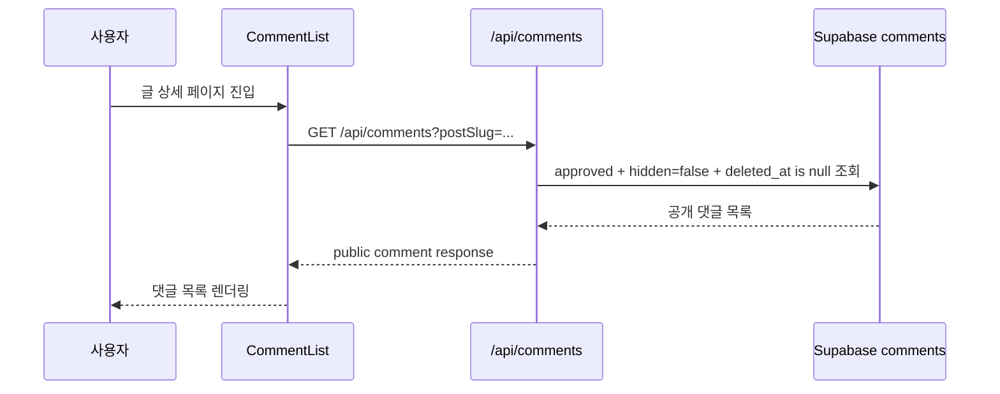
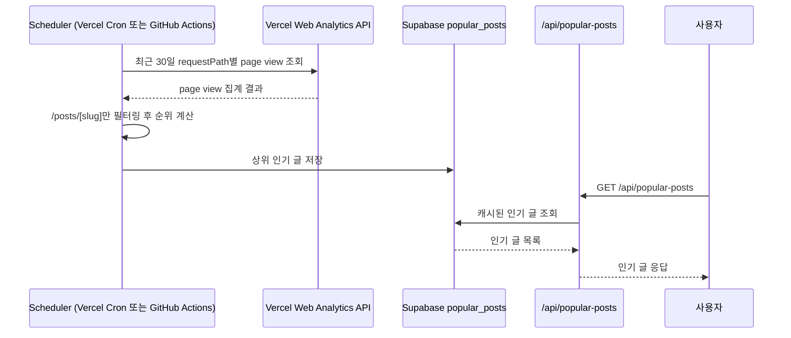
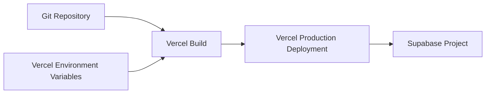

# 인프라 아키텍처

## 목표

정적 중심 Next.js 블로그를 Vercel에 배포하고, 동적 기능은 최소한의 serverless/API 조합으로 처리한다.

핵심 원칙:

- 블로그 본문과 태그 페이지는 가능한 정적으로 제공한다.
- 댓글, moderation, 인기 글 집계는 serverless route에서 처리한다.
- 별도 VPS나 항상 켜져 있는 백엔드 서버는 운영하지 않는다.
- 민감한 API key는 클라이언트에 노출하지 않는다.

## 전체 인프라 구성



## 정적 페이지 제공 흐름



정적으로 제공하는 대상:

```txt
/
/posts
/posts/[slug]
/craft
/tags/[tag]
/rss.xml
/sitemap.xml
```

`/tags/[tag]`는 API 없이 MDX frontmatter의 `tags`를 빌드 시점에 수집해 생성한다.

## 댓글 작성 흐름



댓글 상태 매핑:

```txt
allow        → approved
needs_review → pending
reject       → spam 또는 rejected
```

공개 화면에는 `approved` 댓글만 노출한다.

## 댓글 조회 흐름



public response에는 내부 필드를 포함하지 않는다.

제외 필드:

```txt
moderation_result
ip_hash
user_agent_hash
hidden
deleted_at
```

## 인기 글 집계 흐름



초기 기준:

```txt
popularScore = recentPageViews
```

추후 확장:

```txt
popularScore = recentPageViews + approvedCommentCount * 5
```

스케줄러 전략:

```txt
기본값: Vercel Cron 하루 1회
필요 시: GitHub Actions scheduled workflow로 하루 2회 이상 실행
```

Vercel Hobby plan에서는 Cron이 하루 1회로 제한되므로, 하루 2회 이상 집계가 필요해질 가능성까지 대비하려면 GitHub Actions workflow를 같은 batch job의 대체 실행 환경으로 둔다.

GitHub Actions를 사용할 때도 결과 저장 위치는 동일하다.

```txt
GitHub Actions
→ Vercel Web Analytics API 조회
→ 인기 글 계산
→ Supabase popular_posts 갱신
```

## 데이터 저장소

### Supabase `comments`

역할:

- 댓글 저장
- moderation 상태 관리
- 숨김/삭제 상태 관리

주요 상태:

```txt
pending
approved
spam
rejected
```

### Supabase `popular_posts`

역할:

- Vercel Web Analytics API로 계산한 인기 글 결과 저장
- 홈/글 목록의 인기 글 섹션에 빠르게 제공

인기 글 결과는 Supabase table에 저장한다. 이렇게 하면 GitHub Actions나 Vercel Cron 중 어느 쪽에서 batch job을 실행해도 같은 저장소를 갱신할 수 있고, Supabase editor에서 값 확인과 수동 보정도 가능하다.

## 환경 변수

서버 전용:

```txt
TURNSTILE_SECRET_KEY
SUPABASE_SECRET_KEY
AI_API_KEY
VERCEL_ACCESS_TOKEN
VERCEL_PROJECT_ID
POPULAR_POSTS_REFRESH_SECRET
ADMIN_SECRET
```

GitHub Actions를 스케줄러로 사용할 경우, 다음 값은 GitHub Repository Secrets에도 등록한다.

```txt
SUPABASE_SECRET_KEY
NEXT_PUBLIC_SUPABASE_URL
VERCEL_ACCESS_TOKEN
VERCEL_PROJECT_ID
```

클라이언트 노출 가능:

```txt
NEXT_PUBLIC_SITE_URL
NEXT_PUBLIC_TURNSTILE_SITE_KEY
NEXT_PUBLIC_SUPABASE_URL
NEXT_PUBLIC_SUPABASE_ANON_KEY
```

주의:

- `SUPABASE_SECRET_KEY`는 클라이언트에 노출하지 않는다.
- `TURNSTILE_SECRET_KEY`는 클라이언트에 노출하지 않는다.
- `AI_API_KEY`는 클라이언트에 노출하지 않는다.
- `VERCEL_ACCESS_TOKEN`은 cron/serverless/build/GitHub Actions 작업에서만 사용한다.

## 배포 구성



배포 전 확인:

- Vercel 프로젝트 생성
- Supabase 프로젝트 생성
- Vercel Web Analytics 활성화
- Vercel Cron 또는 GitHub Actions schedule 설정
- Turnstile site/secret key 발급
- AI moderation API key 설정
- 환경 변수 등록

## 운영 메모

- 댓글 관리는 초기에는 Supabase table/editor에서 처리한다.
- 별도 admin UI는 댓글이 많아진 뒤 만든다.
- 인기 글은 실시간 계산하지 않고 cron으로 계산한 결과를 캐싱한다.
- 댓글 또는 인기 글 API가 실패해도 전체 페이지 렌더링은 깨지지 않아야 한다.
